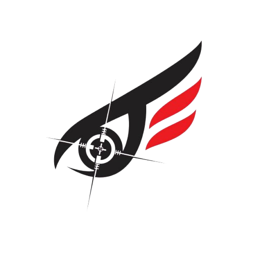

<p align="center">
  
</p>

_____________________________________________________________________________________________________

# Security Scanner

Un outil automatisé pour scanner la sécurité des systèmes et sites web. Ce script bash effectue une série de scans de sécurité courants, enregistre les résultats et génère un rapport de synthèse.

## Fonctionnalités

- **Scan Nmap**: Service & version detection, OS detection
- **Scan Dirb**: Découverte de répertoires et fichiers
- **Scan Nikto**: Détection de vulnérabilités web
- **Scan Gobuster**: Brute force de chemins et fichiers
- **Scan SQLMap**: Détection d'injections SQL
- **Interface utilisateur**: Colorée et conviviale
- **Rapports**: Génération automatique avec synthèse

## Prérequis

Le script nécessite les outils suivants :
- nmap
- dirb
- nikto
- gobuster
- sqlmap

Sur les systèmes basés sur Debian/Ubuntu, vous pouvez les installer avec :

```bash
sudo apt update
sudo apt install nmap dirb nikto gobuster sqlmap
```

# Installation 

## Option 1: Installation avec une seule commande 

```bash 
curl -sSL https://raw.githubusercontent.com/mpgamer75/security-scanner/main/install.sh | bash
```
## Option 2: Installation manuelle

1. Téléchargez le script: 

```bash
git clone https://github.com/mpgamer75/security-scanner.git
cd security-scanner
```
2. Rendez-le exécutable:

```bash
chmod +x security
```
3. Installez-le globalement: 
```bash
sudo mv security /usr/local/bin/
```

# Utilisation 

1. Lancez le scanner: 

```bash
security
```

2. Suivez les instructions à l'écran: 
    - Entrez l'adress IP cible
    - Entrez l'URL du site web (optionnel)

3. Le script créera un dossier scan_results_DATE_HEURE contenant tous les résultats

# Avertissement

Cet outil est destiné à être utilisé uniquement sur des systèmes pour lesquels vous avez l'autorisation de réaliser des tests de sécurité. L'utilisation de cet outil sur des systèmes sans autorisation peut être illégale et contraire à l'éthique.

# Licence 
Ce projet est sous licence MIT - voir le fichier LICENSE pour plus de détails.

# Contribution 
Vous pouvez aider si vous voulez :D 

# Auteur 
- **mpgamer75**-Github 